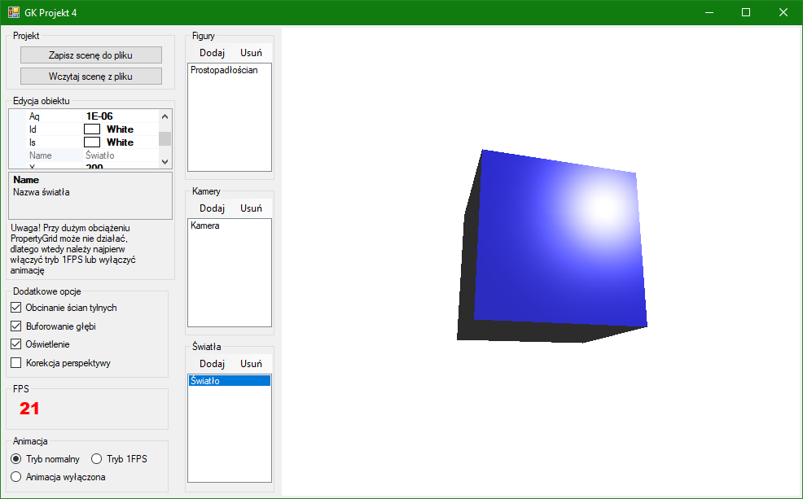
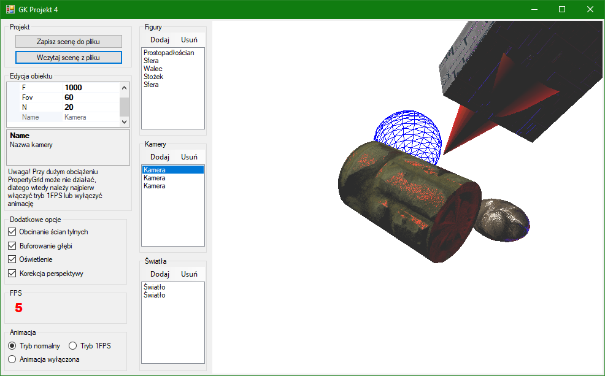
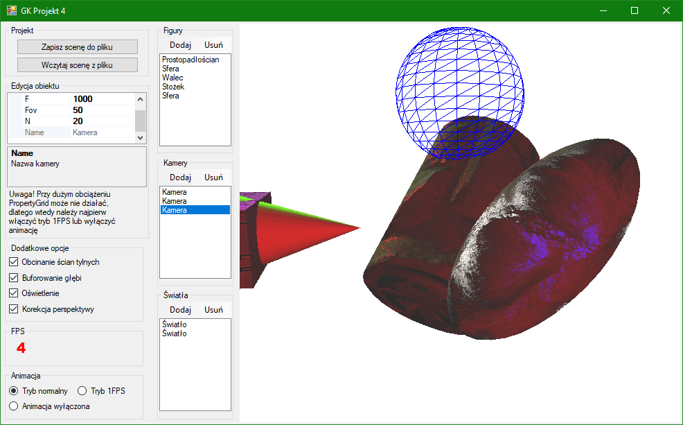

# 3d-figures
Jeden z projektów studenckich na przedmiocie "Grafika komputerowa 1" na wydziale MiNI PW.

Celem projektu było zaimplementowanie prostego edytora figur 3D, w szczególności algorytmów związanych z przetwarzaniem grafiki 3D:
- algorytm Bresenhama,
- wypełnianie algorytmem scan-linii zoptymalizowanym dla trójkątów,
- algorytm Sutherlanda-Hodgmana,
- model oświetlenia Phonga z osłabieniem światła wraz z odległością,
- cieniowanie Phonga,
- teksturowanie i mapowanie normalnych,
- buforowanie głębi,
- obcinanie ścian tylnych,
- korekcja perspektywy.

Potok renderowania wykonywany jest na CPU.
Rozwiązanie zostało wykonane w MS VS 2017 wykorzystując Windows Forms.

Rozwiązanie w katalogu *Textures* zawiera przykładowe tekstury ze strony <https://freepbr.com/> wraz z odpowiadającymi im mapami normalnych, które można nałożyć na wybrane figury.
Klasy `LockBitmap` oraz `DirectBitmap` nie są mojego autorstwa, przy ich implementacjach znajdują się odwołania do źródeł.

## Przykładowe zrzuty ekranu z aplikacji:

---

## Instrukcja

Na początku warto zaznaczyć, że kompilując aplikację w MS VS lepiej wybrać tryb "Release" z uwagi na wydajność.

Dodam tutaj jeszcze, że edycję właściwości obiektów realizuję w PropertyGrid i przy dużym obciążeniu nie zawsze działa to poprawnie (tj. mimo wpisania nowej wartości właściwości, nie aktualizuje się ona).
W takiej sytuacji, należy albo wejść w tryb 1FPS albo całkowicie wyłączyć animację (za pomocą odpowiednich radiobuttonów w lewym dolnym rogu), by zmniejszyć obciążenie.
Następnie można powrócić do normalnego trybu odświeżania sceny.

W katalogu *Scenes* znajduje się zapisana przykładowa scena, którą można wczytać.

#### Funkcjonalności:

- Aby dodać figurę na scenę należy w GroupBoxie „Figury” kliknąć „Dodaj”, a następnie wybrać odpowiednią figurę. Figury domyślnie dodają się w punkcie (0,0,0).
- Aby usunąć figurę ze sceny należy wybrać konkretną figurę na liście figur w GroupBoxie „Figury”, a następnie trzeba kliknąć „Usuń”.
- Edycja figur poprzez zmianę ich parametrów - wybieramy konkretną figurę na liście figur. Wówczas w GroupBoxie „Edycja obiektu”, w PropertyGridzie pokazują się właściwości danej figury podzielone na kategorie. W kategorii „Parametry figury” znajdują się takie rzeczy jak wymiary figur, czy liczba podziałów siatki. Po kliknięciu na konkretną właściwość pokazuje się też jej opis. W kategorii „Światło” znajdują się właściwości związane z modelem oświetlenia (współczynniki *k_d* (diffuse), *k_a* (ambient), *k_s* (specular) oraz *shininess* - patrz *model oświetlenia Phonga*). W kategorii „Transformacje” znajdują się parametry związane z transformacjami. W kategorii „Wypełnienie” znajdują się właściwości *Fill* oraz dwie właściwości ze ścieżkami do tekstury i mapy normalnej. Właściwość *Fill* może być równa None i wtedy figura nie ma wypełnienia (tj. są rysowane jedynie krawędzie trójkątów w kolorze *k_d*), *SingleColor* i w takiej sytuacji figura wypełniana jest kolorem *k_d* albo *Texture* i w takiej sytuacji figura będzie teksturowana. Żeby wybrać opcję teksturowania dla figury, należy najpierw wskazać dla niej plik z teksturą oraz mapą normalną.
- Dodawanie i usuwanie świateł punktowych jest analogiczne jak w przypadku figur. By dodać światło należy w GroupBoxie „Światła” kliknąć „Dodaj”. Dodane zostanie światło z domyślnymi parametrami. Usuwanie realizujemy przez wybranie światła z listy świateł i kliknięciu „Usuń”. Edytowanie wszystkich właściwości światła jest realizowane w tym samym PropertyGrid, co w przypadku figur, po kliknięciu na konkretne światło na liście świateł.
- Dodawanie i usuwanie kamer realizowane jest analogiczne jak dla figur i świateł. Nie można usunąć kamery, gdy jest na scenie tylko jedna. Parametry kamery edytujemy w tym samym PropertyGrid, co figury i światła. Przełączanie się pomiędzy kamerami realizujemy poprzez wybranie konkretnej kamery (czyli normalnie klikamy LPM na kamerę, na którą chcemy się przełączyć). Opiszę teraz bardziej szczegółowo **obsługę kamery myszką**. *P* to pozycja kamery, zaś *T* to obserwowana pozycja. Obroty realizujemy przez kliknięcie *LSHIFT* i przesuwanie myszką po PictureBoxie. Obrót realizowany jest jako obrót pozycji *P* wokół punktu *T*. W szczególności, przesuwanie myszki w pionie odpowiada obrotowi kamery w pionie, zaś przesuwanie myszki w bok odpowiada obrocie na boki. Ponadto, ruch myszki zrobiłem jako odwrotny do kierunku obrotu kamery (było to dla mnie bardziej intuicyjne w obsłudze). To znaczy, że jeśli myszkę przesuwamy w lewo, to kamera obraca się w prawo, czyli widoczna scena obraca się w lewo (zgodnie z ruchem myszki). To samo dla innych kierunków. Mając kliknięty *LSHIFT* i przesuwając jednocześnie scrollem myszki przybliżamy się lub oddalamy pozycją kamery od punktu *T* (przy czym dałem w kodzie minimalną odległość 0,001 od punktu *T*, na jaką możemy się zbliżyć). Tutaj zaznaczę wyraźnie, że scrollując z klikniętym *LSHIFT* przesuwamy jedynie pozycję *P* kamery, punkt na który patrzymy *T* jest nieruchomy. Używając scrolla bez *LSHIFT* przesuwamy pozycję *P* w kierunku *T*, jednak tutaj przesuwa się zarówno *P*, jak i *T* (czyli odległość między *P* i *T* jest stała – w szczególności zmienia się punkt obrotu). Można jeszcze przesuwać kamerę po płaszczyźnie prostopadłej do prostej *PT* i przechodzącej przez punkt *P*. Jest to realizowane przez przesuwanie się myszką po PictureBoxie (bez używania *LSHIFT*). Tutaj również odwróciłem kierunki (tj. przesuwając myszką w lewo, kamera przesuwa się w prawo, czyli scena wizualnie przesuwa się w lewo zgodnie z kierunkiem myszki). Zaznaczę jeszcze, że w tym przypadku przesuwa się zarówno pozycja *P*, jak i target *T*.
- Do włączania/wyłączania obcinania ścian tylnych, z-bufora, modelu oświetlenia (domyślnie wyłączony, czyli światła nie mają żadnego wpływu na figury) i korekcji perspektywy służą odpowiednie checkboxy. Oczywiście, jeśli jakiś obiekt jest oteksturowany to po włączeniu oświetlenia wykorzystywana jest również jego mapa normalnych. Przypomnę tylko, że każda figura może być wyrysowana tylko jako krawędzie trójkątów, pojedynczy kolor lub oteksturowana (właściwość *Fill* figury).
- FPS wyświetlane jest w GroupBoxie „FPS”.
- Okienko jest skalowalne, przy czym należy pamiętać, że w przypadku wyłączenia animacji, PictureBox się nie odświeży poprawnie.
- Zapisywanie/wczytywanie z pliku realizujemy przez kliknięcie odpowiedniego przycisku w lewym górnym rogu i wybranie stosownego pliku. Plik nie musi mieć rozszerzenia.

## Opis implementacji

Bardziej szczegółowy opis zagadnienień dotyczących implementacji można znaleźć w pliku *Opis.pdf*.

## TODO

- Poprawa działania PropertyGrid do edycji właściwości przy dużym obciążeniu lub całkowita zmiana sposobu edycji.
